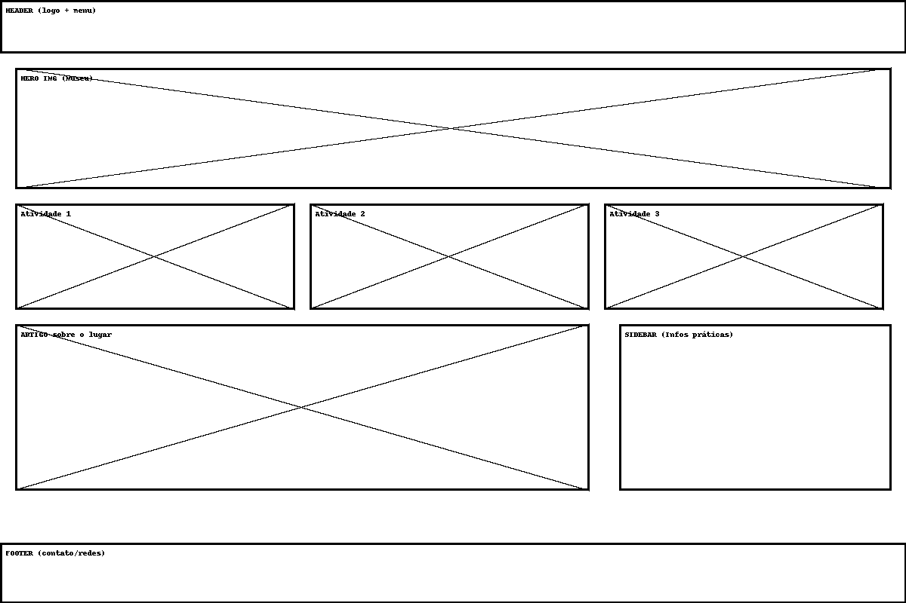
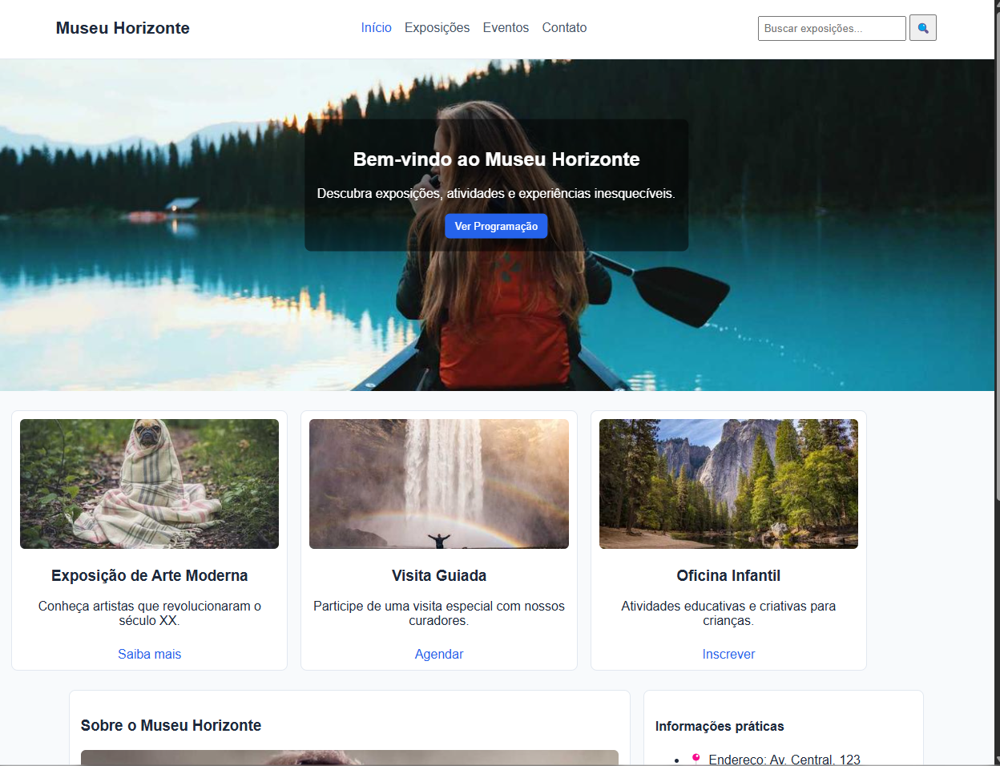

# Trabalho Prático - Semana 03

## Informações Gerais
- Nome: Matheus Nicoli Andrade Coelho
- Matrícula: 885645
- Proposta de projeto escolhida: Lugares e Experiências — Museu e Exposições
- Breve descrição: O **Museu Horizonte** é um portal fictício que apresenta exposições, eventos e atividades culturais.

## Print do wireframe

## Print da home-page

